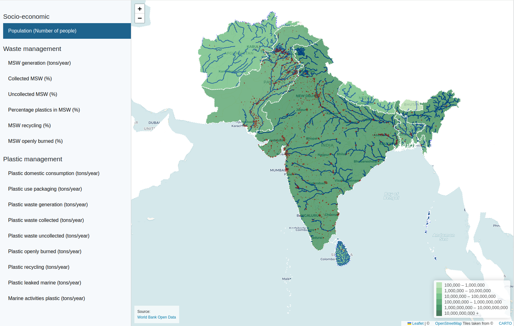

# What is this?

This in an interactive map with data related to plastic waste in the South Asia Region (SAR). It was developed for the World Bank, as part of the [PLEASE project](https://www.sacepplease.org/).

Live demo: https://aepinilla.github.io/plastic_indicators/

# Instructions

1. Download this repository (click on the green button, and select download as Zip. You can also clone it with this command:

```git clone git@github.com:aepinilla/plastic_indicators.git```

2. Open the index.html file.

You should see something like this:


